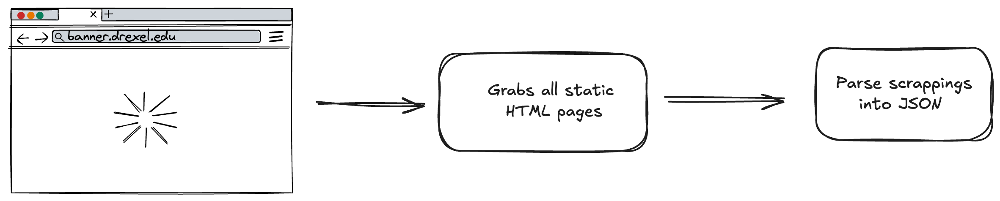
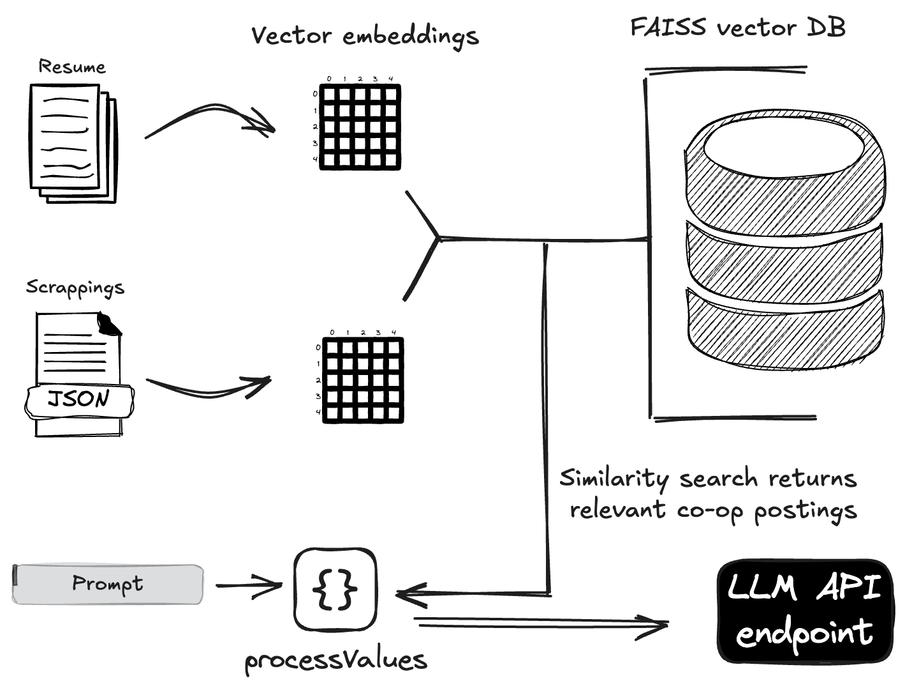

## About

Ever get tired of manually scrolling through all the co-op postings on DrexelOne all within one week? Now you don't have to!

This project aims to help anyone find the most suitable co-op positions by using LLMs.

```
                          ,     \    /      ,
                         / \    )\__/(     / \
                        /   \  (_\  /_)   /   \
     __________________/_____\__\@  @/___/_____\_________________
     |                          |\../|                          |
     |                           \VV/                           |
     |             D-R-E-X-E-L C-O-O-P M-A-T-C-H-E-R            |                      
     |__________________________________________________________|
                   |    /\ /      \\       \ /\    |
                   |  /   V        ))       V   \  |
                   |/     `       //        '     \| 
                   `              V                ' 
 ```

## How it works

**1. Web Scraping**



* Uses Selenium to log into DrexelOne and scrape available co-op postings.
* Saves all the static HTML pages in a directory.
* Uses BeautifulSoup to parse all the scraping into a single json file.

**2. LLM pipeline**



* Data Preparation:

    * Reads the scraped co-op postings from the JSON file and extracts key information (title, description, qualifications).
    * Reads a user's resume from a PDF file, extracting all text content.

* Embedding & Indexing:

    * Uses the Google Gemini embedding model (`models/embedding-001`) to generate vector embeddings for both the resume and co-op postings.
    * Chunks text before embedding to create more meaningful representations.
    * Calculates average embeddings for all the co-op posting data.
    * Creates a FAISS index from the embeddings of all the scraped co-op postings.

* Similarity Search:

    * Uses the FAISS index to perform a similarity search, finding the top `k` co-op postings that are most similar to the resume embedding.

* LLM Ranking:

    * Constructs a prompt for a Google Gemini Pro model, including:
        * The full text content of the user's resume.
        * The top `k` co-op postings that are most similar to the user's resume based on the FAISS search.
    * Outputs the top positions user should apply for.


## Usage

1. Clone this repository:
```bash
git clone https://github.com/key-r-code/drexel-co-op-matcher.git
cd drexel-co-op-matcher
```

2. Set up virtual env
```bash
python3 -m venv venv
source venv/bin/activate  # On macOS/Linux
venv\Scripts\activate  # On Windows
```

3. Install dependencies:
```bash
pip install -r requirements.txt
```

4. Create a `.env` file and replace with your gemini API key. See [.env.example](.env.example)
```bash
touch .env
```

5. Add resume PDF in the same directory

6. Add Drexel credentials in [main.py](main.py)

7. Run `main.py`:
```bash
python3 main.py
```
This will create a subdirectory and save all the static HTML files.

Change the name of the HTML directory in `dragonScraper.py` if you used the scraper before.

8. Run `parsing_htmls.py`:
```bash
python3 parsing_htmls.py
```
This will parse all the HTML files and create a single JSON file.

9. Run `gemini-analysis-starter-nb.ipynb`

## TO DO:

**dragonScraper.py**

- ~~Add pagination handling~~
- ~~Add upcoming co-op postings and previously applied co-ops~~
- Replace all time.sleep() calls with self.wait.until
- Add Chrome and Firefox support (currently only support Safari WebDriver)

**LLM-pipeline**

- Add a geminiPipeline class
- Find optimal `chunk_size` and `chunk_overlap`

**CLI App**

- Add API key handling
- Add A/B/C round navigation
- Add major navigation


## Contributions

Contributions are welcome! To contribute:

1. Fork the repository.
2. Create a new branch (`git checkout -b feature/my-new-feature`).
3. Make your changes.
4. Commit your changes (`git commit -am 'Add new feature'`).
5. Push to the branch (`git push origin feature/my-new-feature`).
6. Create a pull request.

